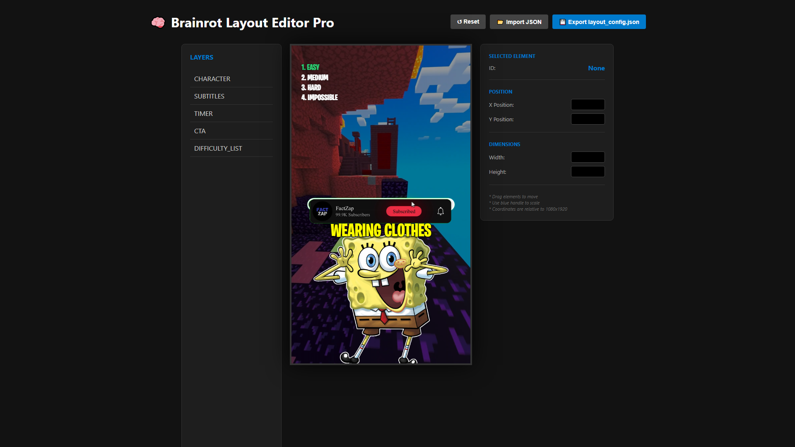

<div align="center">

<!-- TODO: Insert a REAL screenshot or banner of your project here -->
<!--  -->

# 🧠 YouTube AI Brainrot Automation

**The ultimate high-performance pipeline for generating viral, highly-engaging "Brainrot" style videos for YouTube Shorts, TikTok, and Instagram Reels.**

[](https://opensource.org/licenses/MIT)
[](https://www.python.org/downloads/)
[](https://github.com/ZiggyMar/Youtube-Ai-Brainrot-Automation/issues)

</div>

---

## 📖 Overview

Welcome to the **YouTube AI Brainrot Automation** project! This is a robust, highly-automated video production pipeline specifically designed to create viral short-form content. By leveraging multiple Large Language Models (LLMs), AI Voice Cloning, and frame-perfect subtitle synchronization, you can produce engaging trivia, quizzes, and brainrot-style videos in minutes, not hours.

## 🚀 Key Features

*   🎥 **Visual Layout Editor**: A custom browser-based tool to visually position and scale all video elements, avoiding tedious coordinate guessing.
*   ⏱️ **Frame-Perfect Subtitles**: Word-level synchronization using OpenAI Whisper timestamps ensures your subtitles pop exactly when the word is spoken.
*   🧠 **Multi-LLM Fallback Architecture**: Robust script generation using **Gemini, Groq, Mistral, and OpenRouter**. Never hit a rate limit again; if one fails, the system seamlessly falls back to another.
*   🕺 **Dynamic Character Animations**: Automatic character selection and "sway" animations based on the detected mood and energy of the speaker.
*   🎙️ **Professional Audio Mixing**: Automated Text-to-Speech (Edge-TTS), Voice Conversion (RVC), and intelligent background music ducking (auto-lowering music volume when speaking).
*   🎬 **Automated Overlays & Greenscreen**: Integrated timer videos and Call-To-Action (CTA) overlays with automatic green-screen (chroma key) masking.

---

## 📸 Sneak Peek

### The Visual Layout Editor

<div align="center">
  
</div>

*The built-in web editor lets you drag, drop, and scale your character sprites, text, and overlays perfectly into a 9:16 vertical video frame.*

---

## 🛠️ Installation & Setup

### 1. Prerequisites
Ensure you have the following installed on your system:
*   [Python 3.9+](https://www.python.org/downloads/)
*   [FFmpeg](https://ffmpeg.org/download.html) (Ensure it's in your system PATH or located in `tools/ffmpeg/ffmpeg.exe`)
*   Git

### 2. Clone the Repository
```bash
git clone https://github.com/ZiggyMar/Youtube-Ai-Brainrot-Automation.git
cd Youtube-Ai-Brainrot-Automation
```

### 3. Install Dependencies
```bash
pip install -r requirements.txt
```

### 4. Configure Environment Variables
Create a `.env` file in the root directory (do not commit this file). Add your API keys:
```env
GEMINI_API_KEY=your_gemini_key
GROQ_API_KEY=your_groq_key
MISTRAL_API_KEY=your_mistral_key
OPENROUTER_API_KEY=your_openrouter_key
```

*(Note: The project uses a fallback system, so you only strictly need one valid key to start!)*

---

## 🎨 Workflow Guide

### Step 1: Design Your Layout
1. Open `tools/layout_editor.html` in any modern web browser.
2. Drag and scale your visual elements (Character, Subtitles, Timer, CTA) on the canvas.
3. Fine-tune settings like font size in the properties panel.
4. Click **Export layout_config.json**.
5. Move the downloaded `layout_config.json` to the root of your project directory.

### Step 2: Run the Pipeline
Execute the main script to start generating videos:
```bash
python core/main.py
```

### What Happens Next?
1. **Scripting**: An AI agent writes a highly engaging trivia/quiz script.
2. **Audio Generation**: Text is converted to speech via Edge-TTS and passed through an RVC voice model for character voice cloning.
3. **Transcription**: Whisper maps out exact timestamps for every word spoken.
4. **Compositing**: FFmpeg dynamically composites the background, sprites, subtitles, and music.
5. **Output**: Your final, production-ready `.mp4` is saved in the `output/` directory!

---

## 📁 Project Architecture

```text
Youtube-Ai-Brainrot-Automation/
├── assets/                 # Backgrounds, music, fonts, character sprites, docs
├── audio_cache/            # Temp directory for TTS and Whisper outputs
├── core/                   # The engine: Director, Voicebox, Video Factory
├── data/                   # Generated scripts and stored layout configurations
├── gui/                    # (WIP) Future graphical user interface components
├── output/                 # Your final rendered viral videos live here
├── tools/                  # Visual layout editor and FFmpeg binaries
├── utils/                  # Helper scripts and utilities
├── .env.example            # Template for environment variables
└── requirements.txt        # Python package dependencies
```

---

## 🔐 Security Best Practices
*   **Never commit your `.env` file.** Ensure it remains in your `.gitignore`.
*   If you previously committed API keys by accident, please revoke those keys immediately via your provider's dashboard and use a tool like [BFG Repo-Cleaner](https://rtyley.github.io/bfg-repo-cleaner/) to purge them from your git history.

---

## 🤝 Contributing
Contributions, issues, and feature requests are welcome!
1. Fork the Project
2. Create your Feature Branch (`git checkout -b feature/AmazingFeature`)
3. Commit your Changes (`git commit -m 'Add some AmazingFeature'`)
4. Push to the Branch (`git push origin feature/AmazingFeature`)
5. Open a Pull Request

## 📜 License
Distributed under the MIT License. See `LICENSE` for more information.

## 📚 References & Acknowledgments
*   [OpenAI Whisper](https://github.com/openai/whisper) for precise transcription.
*   [Edge-TTS](https://github.com/rany2/edge-tts) for reliable text-to-speech.
*   [Retrieval-based Voice Conversion (RVC)](https://github.com/RVC-Project/Retrieval-based-Voice-Conversion-WebUI) for high-quality voice cloning.
